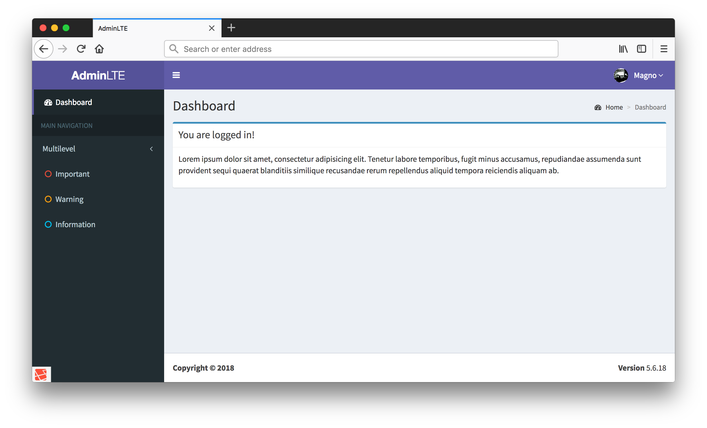

# Laravel Bootstrap



## Getting Started

```bash
# composer create-project --prefer-dist magnobiet/laravel-bootstrap awesome-app-name
git clone https://github.com/magnobiet/laravel-bootstrap awesome-app-name && cd $_

npm install
npm run prod

composer install

php artisan migrate --seed
php artisan passport:install --force
```

### Development

```bash
# Export translatable strings
php artisan translatable:export pt-BR 
```

## Installed packages

- [arcanedev/log-viewer](https://github.com/arcanedev/logviewer)
- [jeroennoten/laravel-adminlte](https://github.com/jeroennoten/laravel-adminlte)
- [jrm2k6/cloudder](https://github.com/jrm2k6/cloudder)
- [kkomelin/laravel-translatable-string-exporter](https://github.com/kkomelin/laravel-translatable-string-exporter)
- [owen-it/laravel-auditing](https://github.com/owen-it/laravel-auditing)
- [prettus/l5-repository](https://github.com/prettus/l5-repository)
- [rollbar/rollbar-laravel](https://github.com/rollbar/rollbar-php-laravel)
- [barryvdh/laravel-debugbar](https://github.com/barryvdh/laravel-debugbar)
- [laracasts/generators](https://github.com/laracasts/laravel-5-generators-extended)

## Security Vulnerabilities

If you discover a security vulnerability within this project, please send an e-mail to [magno.biet@gmail.com](mailto:magno.biet@gmail.com). All security vulnerabilities will be promptly addressed.

## License

This project is licensed under the [MIT License](https://magno.mit-license.org/2018). Copyright © Magno Biét
